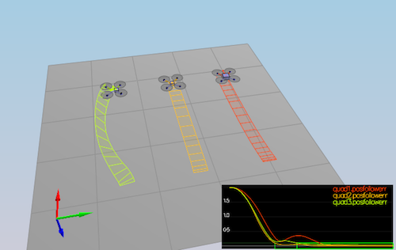
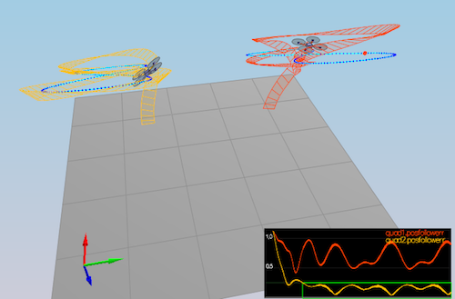

# Writeup

## Scenarios

### Scenario 2 - Body rate and roll/pitch control

`kpPQR` parameter was set to `92, 95, 5`
`kpBank` parameter was set to `10`


```
Simulation #83 (../config/2_AttitudeControl.txt)
PASS: ABS(Quad.Roll) was less than 0.025000 for at least 0.750000 seconds
PASS: ABS(Quad.Omega.X) was less than 2.500000 for at least 0.750000 seconds
```

### Scenario 3 - Position/velocity and yaw angle control

All parameters `kpPosXY`, `kpPosZ`, `KiPosZ` was set to `30`

`kpVelXY` and `kpVelZ` parameters were set to `10`

`kpYaw` 3rd (z) component of `kpPQR` was left same as before `5`


```
Simulation #88 (../config/3_PositionControl.txt)
PASS: ABS(Quad1.Pos.X) was less than 0.100000 for at least 1.250000 seconds
PASS: ABS(Quad2.Pos.X) was less than 0.100000 for at least 1.250000 seconds
PASS: ABS(Quad2.Yaw) was less than 0.100000 for at least 1.000000 seconds
```

### Scenario 4 - Non-idealities and robustness

As red drone didn't end up in target testination, I added integral control to altitude controller and increased `KiPosZ` parameter to `40`.

Green seems to use a trajectory that goes to the left a little bit and red seems to take time to settle because of mass.



```
Simulation #91 (../config/4_Nonidealities.txt)
PASS: ABS(Quad1.PosFollowErr) was less than 0.100000 for at least 1.500000 seconds
PASS: ABS(Quad2.PosFollowErr) was less than 0.100000 for at least 1.500000 seconds
PASS: ABS(Quad3.PosFollowErr) was less than 0.100000 for at least 1.500000 seconds
```

### Scenario 5  - Trajectory follow

Drone following trajectory `FigureEight` seems to be doing it quite well. Drone following trajectory `FigureEightFF.txt` is struggling and flying a little bit off.



```
Simulation #94 (../config/5_TrajectoryFollow.txt)
PASS: ABS(Quad2.PosFollowErr) was less than 0.250000 for at least 3.000000 seconds
```

### Scenario X - Test many quads

In this scenario quads seems to fly to very different directions at first, but once they settle they seems to follow path quite well.


## Rubrics criterias

### Implemented body rate control in C++.

Body rate control is implemented in [/cpp/src/QuadControl::BodyRateControl method ](/src/QuadControl.cpp#L89-L103) as P controller.

### Implemented roll pitch control in C++.

Roll/pitch control is implemented in [/cpp/src/QuadControl::RollPitchControl method ](/src/QuadControl.cpp#L116-L159) as P controller.

### Implemented altitude controller in C++.

Altitude control is implemented in [/cpp/src/QuadControl::AltitudeControl method ](/src/QuadControl.cpp#L161-L201) as PID controller.

### Implemented lateral position control in C++.

Lateral control is implemented in [/cpp/src/QuadControl::LateralPositionControl method ](/src/QuadControl.cpp#L204-L249) as PD controller.

### Implemented yaw control in C++.

Yaw control is implemented in [/cpp/src/QuadControl::YawControl method ](/src/QuadControl.cpp#L252-L272) as P controller.

### Implement calculating the motor commands given commanded thrust and moments in C++.

Motor command are calculated in [/cpp/src/QuadControl::GenerateMotorCommands method ](/src/QuadControl.cpp#L56-L87)
